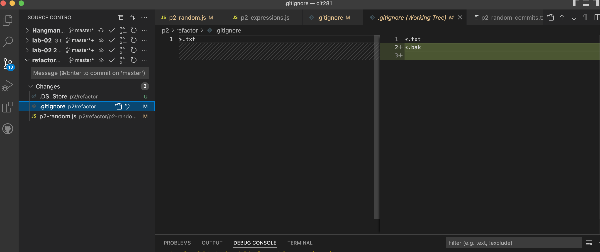

# cit281-p2

## Project Goals and Objectives 
1. Use the command line interface (CLI) of your operating system to create and work with a git repository (repo)
2. Refactor the JavaScript program from the previous project to practice using git and practice refactoring
3. Use git via VSCode
  - Create and use a .gitignore file
  - Diff split screen

### Project Deliverables 
1. refactor/p2-random.js
[p2-random.js](p2-random.js)

2. refactor/p2-random-files.txt
[p2-random-files.txt](p2-random-files.txt)

3. refactor/p2-random-commits.txt
[p2-random-commits.txt](p2-random-commits.txt)

4. refactor/p2-expressions.js
[p2-expressions.js](p2-expressions.js)

5. refactor/p2-vscode-diff.png

